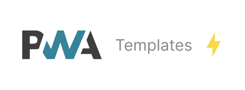

<p align='center'>
<br>
PWA Templates
</p>

<p align='center'>
<a href='https://www.npmjs.com/package/@vite-pwa/create-pwa' target="__blank">

</a>
<a href="https://www.npmjs.com/package/@vite-pwa/create-pwa" target="__blank">
    
</a>
<a href="https://vite-pwa-org.netlify.app/guide/scaffolding" target="__blank">
    
</a>
<br>
<a href="https://github.com/vite-pwa/create-pwa" target="__blank">

</a>
</p>

<br>

<p align="center">
  <a href="https://cdn.jsdelivr.net/gh/antfu/static/sponsors.svg">
    
  </a>
</p>

## 🚀 Features

- 📖 [**Documentation & guides**](https://vite-pwa-org.netlify.app/)
- 👌 **Zero-Config**: sensible built-in default configs for common use cases
- 🔩 **Extensible**: expose the full ability to customize the behavior of the plugin
- 🦾 **Type Strong**: written in [TypeScript](https://www.typescriptlang.org/)
- 🔌 **Offline Support**: generate service worker with offline support (via Workbox)
- ⚡ **Fully tree shakable**: auto-inject Web App Manifest
- 💬 **Prompt for new content**: built-in support for Vanilla JavaScript, Vue 3, React, Svelte, SolidJS and Preact
- ⚙️ **Stale-while-revalidate**: automatic reload when new content is available
- ✨ **Static assets handling**: configure static assets for offline support
- 🐞 **Development Support**: debug your custom service worker logic as you develop your application
- 🛠️ **Versatile**: integration with meta frameworks: [îles](https://github.com/ElMassimo/iles), [SvelteKit](https://github.com/sveltejs/kit), [VitePress](https://github.com/vuejs/vitepress), [Astro](https://github.com/withastro/astro), [Nuxt 3](https://github.com/nuxt/nuxt) and [Remix](https://github.com/remix-run/remix)
- 💥 **PWA Assets Generator**: generate all the PWA assets from a single command and a single source image
- 🚀 **PWA Assets Integration**: serving, generating and injecting PWA Assets on the fly in your application

## 🦄 Usage

> Version v1.0.1: updated all the templates to use **Vite 7**, including also the latest frameworks changes.

> Version v0.6.0: updated all the templates to use **Vite 6**, including also the latest frameworks changes.

> Use version v0.5.0 for **Vite 5** and previous versions of the frameworks.

Since the package name begins with `create-`, it is considered a project generator and can be run simply as `@vite-pwa/pwa`.

This command launches an interactive questionnaire in the command line for configuring different parts of the project.

```bash
# npm
npm create @vite-pwa/pwa@latest

# yarn
yarn create @vite-pwa/pwa

# pnpm
pnpm create @vite-pwa/pwa

# bun
bun create @vite-pwa/pwa
```

Then follow the prompts!

Read the [📖 documentation](https://vite-pwa-org.netlify.app/guide/scaffolding) for a complete guide on how to use it.

## :clock1: Status

Our plan is to release the first version when all Vite templates are ready:
- [x] `VanillaJS` and `TypeScript` templates
- [x] `Vue` and `Vue + TypeScript` templates
- [x] `Lit` and `Lit + TypeScript` templates
- [x] `Svelte` and `Svelte + TypeScript` templates
- [x] `React` and `React + TypeScript` templates
- [x] `Preact` and `Preact + TypeScript` templates
- [x] `SolidJS` and `SolidJS + TypeScript` templates

Later we will add support for meta-frameworks:
- [x] `Nuxt 3` template (from `v0.1.0`): from version `v1.0.0`, only Nuxt v4 template
- [x] `Nuxt 3 Compatibility Version 4 (Nuxt 4)` template (from `v0.4.0`)
- [x] `SvelteKit` template (from `v0.2.0`)
- [ ] `Astro` template
- [x] `Remix` template (from `v0.3.0`)
- [ ] `VitePress` template
- [ ] `Qwik City` template

You can check the progress in the [TODO](./TODO.md) file, previous task lists will be also updated.

If you want to contribute, read the [CONTRIBUTING](./CONTRIBUTING.md) guide.

## 📄 License

[MIT](./LICENSE) License &copy; 2024-PRESENT [Anthony Fu](https://github.com/antfu)
